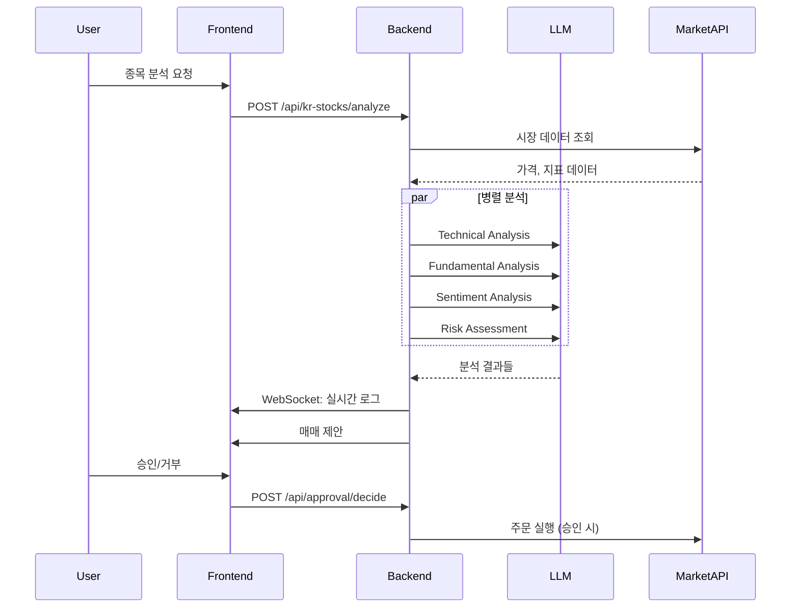
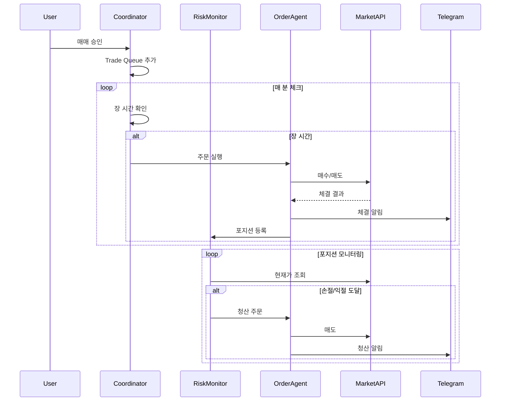

# System Architecture Overview

JonberAI Trading 시스템 아키텍처 개요

---

## 전체 구조

```
┌─────────────────────────────────────────────────────────────┐
│                        Frontend                              │
│                     (React + Vite)                           │
│  ┌──────────────────────────────────────────────────────┐   │
│  │  Pages: Analysis | Trading | Agent Chat | Settings   │   │
│  │  Components: Dashboard, Widgets, Charts, Dialogs     │   │
│  │  Store: Zustand (Global State Management)            │   │
│  │  API: REST Client + WebSocket Client                 │   │
│  └──────────────────────────────────────────────────────┘   │
└────────────────────────┬────────────────────────────────────┘
                         │ HTTP/WebSocket
┌────────────────────────▼────────────────────────────────────┐
│                        Backend                               │
│                      (FastAPI)                               │
│  ┌──────────────────────────────────────────────────────┐   │
│  │  API Routes: analysis, trading, approval, websocket  │   │
│  │  Services: trading, telegram, scanner, kiwoom        │   │
│  │  Agents: LangGraph workflows, Sub-agents             │   │
│  │  Storage: SQLite, Redis (optional)                   │   │
│  └──────────────────────────────────────────────────────┘   │
└────────────────────────┬────────────────────────────────────┘
                         │ API Calls
┌────────────────────────▼────────────────────────────────────┐
│                    External Services                         │
│  ┌──────────────┐ ┌──────────────┐ ┌──────────────────────┐ │
│  │  LLM Server  │ │ Kiwoom API   │ │  Upbit API           │ │
│  │  (Ollama/    │ │ (한국 주식)  │ │  (암호화폐)          │ │
│  │   vLLM)      │ │              │ │                      │ │
│  └──────────────┘ └──────────────┘ └──────────────────────┘ │
│  ┌──────────────┐ ┌──────────────┐                          │
│  │  Telegram    │ │  Naver News  │                          │
│  │  Bot API     │ │  API         │                          │
│  └──────────────┘ └──────────────┘                          │
└─────────────────────────────────────────────────────────────┘
```

---

## Backend 구조

```
backend/
├── app/
│   ├── main.py              # FastAPI 앱 엔트리포인트
│   ├── config.py            # 설정 관리
│   ├── dependencies.py      # 의존성 주입
│   └── api/
│       ├── routes/
│       │   ├── analysis.py      # 미국 주식 분석
│       │   ├── kr_stocks.py     # 한국 주식 분석
│       │   ├── coin.py          # 암호화폐 분석
│       │   ├── trading.py       # 자동매매 API
│       │   ├── approval.py      # HITL 승인
│       │   ├── agent_chat.py    # Agent Group Chat
│       │   ├── websocket.py     # WebSocket 핸들러
│       │   └── scanner.py       # Background Scanner
│       └── schemas/             # Pydantic 스키마
├── agents/
│   ├── graph/
│   │   ├── trading_graph.py     # 미국 주식 워크플로우
│   │   ├── kr_stock_graph.py    # 한국 주식 워크플로우
│   │   └── coin_trading_graph.py # 코인 워크플로우
│   ├── subagents/
│   │   ├── technical_analyst.py
│   │   ├── fundamental_analyst.py
│   │   ├── sentiment_analyst.py
│   │   └── risk_assessor.py
│   ├── tools/                   # Agent 도구
│   └── llm_provider.py          # LLM 추상화
├── services/
│   ├── trading/
│   │   ├── coordinator.py       # 실행 코디네이터
│   │   ├── portfolio_agent.py   # 포트폴리오 관리
│   │   ├── order_agent.py       # 주문 실행
│   │   ├── risk_monitor.py      # 리스크 모니터
│   │   └── models.py            # 트레이딩 모델
│   ├── kiwoom/                  # 키움 API 클라이언트
│   ├── telegram/                # 텔레그램 알림
│   ├── background_scanner/      # 종목 스캐너
│   └── news/                    # 뉴스 서비스
├── models/                      # 데이터 모델
└── tests/                       # 테스트
```

---

## Frontend 구조

```
frontend/
├── src/
│   ├── main.tsx                 # 앱 엔트리포인트
│   ├── App.tsx                  # 루트 컴포넌트
│   ├── components/
│   │   ├── layout/              # 레이아웃 (Header, Sidebar, etc.)
│   │   ├── analysis/            # 분석 관련 컴포넌트
│   │   ├── trading/             # 트레이딩 대시보드
│   │   ├── agent-chat/          # Agent Group Chat
│   │   ├── approval/            # HITL 승인 다이얼로그
│   │   ├── charts/              # 차트 컴포넌트
│   │   └── ui/                  # 공통 UI 컴포넌트
│   ├── hooks/
│   │   ├── useAnalysisWebSocket.ts
│   │   ├── useTradeNotifications.ts
│   │   └── useMarketHours.ts
│   ├── store/
│   │   └── index.ts             # Zustand 스토어
│   ├── api/
│   │   ├── client.ts            # REST API 클라이언트
│   │   └── websocket.ts         # WebSocket 클라이언트
│   ├── types/
│   │   └── index.ts             # TypeScript 타입
│   └── utils/
│       └── translations.ts      # 다국어 지원
└── vite.config.ts
```

---

## 데이터 흐름

### 분석 워크플로우



### 자동매매 흐름



---

## 기술 스택 상세

### Backend

| 기술 | 용도 | 버전 |
|------|------|------|
| FastAPI | API 프레임워크 | 0.109+ |
| LangGraph | Agent 워크플로우 | 0.0.40+ |
| Pydantic | 데이터 검증 | 2.5+ |
| SQLAlchemy | ORM | 2.0+ |
| httpx | HTTP 클라이언트 | 0.26+ |
| structlog | 구조화된 로깅 | 24.1+ |

### Frontend

| 기술 | 용도 | 버전 |
|------|------|------|
| React | UI 라이브러리 | 18+ |
| Vite | 빌드 도구 | 5+ |
| TypeScript | 타입 시스템 | 5+ |
| Zustand | 상태 관리 | 4+ |
| TailwindCSS | 스타일링 | 3+ |
| Lightweight Charts | 차트 | 4+ |

### Infrastructure

| 기술 | 용도 |
|------|------|
| Ollama/vLLM | LLM 서빙 |
| SQLite | 로컬 데이터베이스 |
| Redis | 캐싱/세션 (선택) |
| WebSocket | 실시간 통신 |
